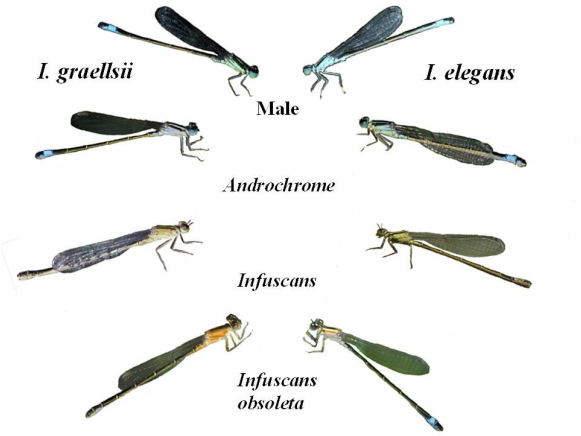

## 01. Filogenómica

En este modulo utilizaremos múltiples programas para realizar un análisis filogenético a partir de secuencias públicas. Como ejemplo práctico intentaremos inferir el origen evolutivo de los polimorfismos de color de las libélulas del género *Ischnura*. [Aquí](https://bioone.org/journals/odonatologica/volume-49/issue-3-4/zenodo.4268559/The-evolutionary-history-of-colour-polymorphism-in-Ischnura-damselflies-Odonata/10.60024/zenodo.4268559.full) y [aquí](https://www.sciencedirect.com/science/article/pii/S1055790321000671) te compartó dos artículos por si quieres leer más de este tema y profundizar más en este interesante modelo de estudio.

### Software que utilizaremos

#### R
+ [R](https://www.r-project.org/)
+ [RStudio](https://posit.co/downloads)
+ [tidyverse](https://tidyverse.org/)
+ [phylotools](https://github.com/helixcn/phylotools)
+ [phytools](https://cran.r-project.org/web/packages/phytools/index.html)

#### Bash
+ [conda](https://www.anaconda.com/docs/getting-started/miniconda/install/linux-install)
+ [e-utilities](https://www.ncbi.nlm.nih.gov/books/NBK179288/)
+ [muscle](https://www.nature.com/articles/s41467-022-34630-w) 
+ [seqkit](https://bioinf.shenwei.me/seqkit/)
+ [modeltest-ng](https://github.com/ddarriba/modeltest)
+ [raxml-ng](https://academic.oup.com/bioinformatics/article/35/21/4453/5487384)

#### Herramientas de interfáz gráfica
+ [MEGA](https://www.megasoftware.net/)
+ [figtree](https://tree.bio.ed.ac.uk/software/figtree/)

**Dado que muchas herramientas son instaladas con conda solo es indispensable que tengas instalado R, Rstudio, conda y MEGA para iniciar el curso.**

En los scripts de cada análisis encontrarás comentarios con información adicional para instalar los software que utilizaremos.

 
