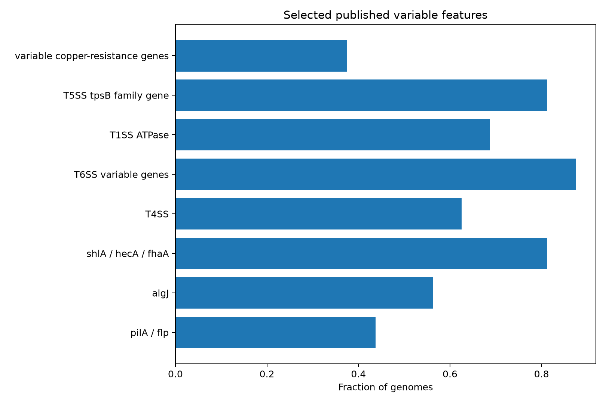

## Pangenómica

En este modulo realizaremos un análisis pangenómico de múltiples variedades del patógeno *Pseudomonas syringae* que infecta las plantas de chile. Éste análisis se realizará empleando datos simulados de bajo tamaño para poder correrlos en laptops sin necesidad de alto rendimiento computacional.

### Software que utilizaremos

- [Python](https://www.python.org/)
- [JupyterLab](https://jupyterlab.readthedocs.io/en/latest/)

Estos programas pueden ser instalados con `conda` empleando el siguiente script de Bash:

```
conda create -n python python=3.13
conda activate python
conda install jupyterlab numpy pandas scipy matplotlib
jupyter lab
```

 
